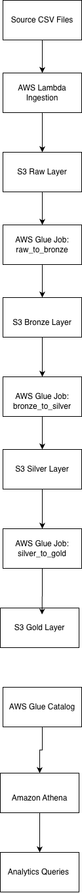
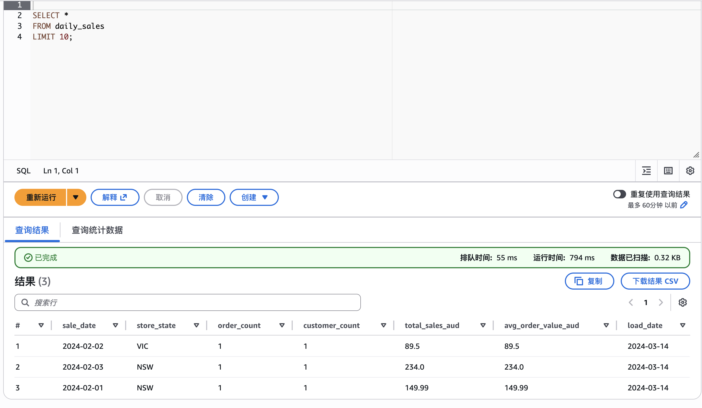

# AWS Serverless Retail Data Platform

This repository contains a serverless data platform built on AWS.  
The goal of the project was to build a realistic end-to-end data pipeline using tools commonly used in data engineering roles.

The pipeline ingests retail transaction data, processes it through a **Medallion architecture (Raw → Bronze → Silver → Gold)** and exposes analytics tables that can be queried with **Athena**.

The dataset models a simplified **Australian retail scenario (AUD currency, NSW/VIC/QLD regions)**.

---

## Architecture

Pipeline flow:

CSV → Lambda → S3 Raw → Glue ETL → Bronze → Silver → Gold → Athena

---

## Tech Stack

- AWS S3  
- AWS Glue (PySpark)  
- AWS Athena  
- AWS Lambda  
- AWS EventBridge  
- Terraform  
- Python  
- Parquet  
- dbt  

---

## Idempotent Pipeline Behaviour

The pipeline is designed to be idempotent for a given `load_date`.

Re-running the same pipeline for the same date overwrites the target output and produces the same result, which makes debugging and recovery easier.

## Project Structure

serverless-aws-data-platform

ingestion/                 Lambda ingestion code  
glue_jobs/                 Glue ETL scripts  
infrastructure/terraform/  Infrastructure as Code  
sql/athena/                Athena table definitions  
dbt/                       Analytics modelling  
tests/                     Unit tests  
docs/                      Architecture and runbooks  
sample_data/               Example retail datasets  

---

## Pipeline Flow

1. Lambda uploads CSV files into the **S3 raw layer**  
2. Glue job **raw_to_bronze** converts raw CSV data into Parquet  
3. Glue job **bronze_to_silver** cleans and standardizes the data  
4. Glue job **silver_to_gold** generates analytics-ready tables  
5. Athena queries the **Gold layer**

---

## Data Lake Layers

Raw  
Original CSV files uploaded through Lambda ingestion.

Bronze  
Raw data converted into **Parquet format** with minimal transformation.

Silver  
Cleaned datasets with standardized schema.

Gold  
Analytics-ready tables used for reporting.

---

## Gold Tables

daily_sales  
Daily revenue metrics by state.

product_performance  
Product level revenue and quantity metrics.

customer_value  
Customer lifetime value metrics.

Tables are partitioned by **load_date** to improve Athena query performance.

---

## Example Query

SELECT *
FROM daily_sales
WHERE load_date = '2024-03-14';

Query result:

---

## Data Quality

Basic validation checks applied during transformation:

customer_id cannot be null  
order_id must be unique  
amount_aud must be greater than zero  
quantity must be greater than zero  

Invalid records are filtered before writing to curated layers.

More details can be found in:

docs/data_quality_checks.md

---

## Cost Considerations

The platform uses fully serverless services.

Typical monthly cost with small datasets:

S3 storage < $1  
Glue jobs < $5  
Athena queries < $2  
Lambda execution < $1  

Estimated total monthly cost: under $10.

Observability

The pipeline includes basic observability through AWS CloudWatch.

Lambda execution logs are written to CloudWatch for ingestion debugging.
Glue job logs are available through CloudWatch for ETL troubleshooting.

This allows failed pipeline runs to be diagnosed through centralize
---

## Design Decisions

Athena instead of Redshift

Athena works well here because it is serverless, requires no cluster management, and integrates directly with S3.

Parquet format

Using Parquet reduces storage cost and improves Athena query performance.

load_date parameter

The pipeline supports running with a specific load_date to make backfills and debugging easier.

---

## Limitations

This project intentionally simplifies some aspects:

Uses sample datasets only  
Glue jobs are triggered manually  
No CDC ingestion  
Limited monitoring and alerting  

---

## Possible Improvements

Add Step Functions orchestration  
Add CI/CD pipeline for Terraform and Glue jobs  
Introduce stronger data quality validation  
Add monitoring and alerting  
Add a BI dashboard layer  

---

## Why I Built This

The goal was to build something closer to a real data engineering workflow instead of isolated scripts.

This repository demonstrates the core parts of a modern cloud data pipeline:

data ingestion  
data transformation  
data storage  
analytics querying  
infrastructure automation
